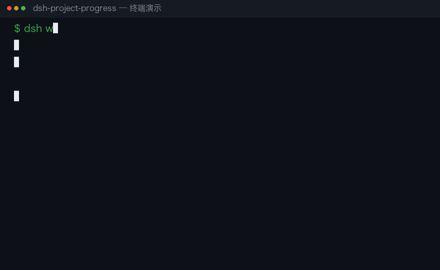

# dsh-project-progress

[](https://github.com/zhangqijin890-bot/project-progress/actions/workflows/ci.yml)
[](https://www.npmjs.com/package/@zhangqijin890-bot/dsh-project-progress)
[](LICENSE)

A [DeepSeek Harness](https://github.com/deepseek-ai/deepseek-harness) (DSH) plugin that
**auto-creates a project record per workspace, auto-syncs project progress, and lets a
fresh session pick up where the last one ran out of context.**

## Demo



## Features

1. **Auto-create projects** — start a conversation in any workspace and the plugin
   creates a project record under `$DSH_HOME/projects/<project-key>/`.
2. **Auto-sync progress** — at every turn end it appends `request → reply → tools` to a
   structured log (`log.json`) and regenerates a human-readable `progress.md`; an LLM
   digest of the "current state" (`digest.txt`) is refreshed on a debounced interval
   (falls back to a rule-based digest when the LLM is unavailable).
3. **Backfill existing sessions** — sessions that predate the plugin also get project
   files: live sessions are backfilled automatically at boot, and `/project backfill`
   scans every persisted session (idempotent — re-running adds no duplicates).
4. **Fresh-session handoff** —
   - auto-injects the progress digest into the first turn of a new session;
   - tools `get_project_progress` / `update_project_progress` let the model read
     progress and leave handoff notes;
   - `/project` command shows progress, `/project sync` refreshes the digest,
     `/project path` prints the progress file path.

## Storage layout

```
$DSH_HOME/projects/<project-key>/
├── project.json   # metadata: title, path, session list, counters
├── log.json       # bounded structured turn log (default 200 entries)
├── notes.json     # handoff notes (written via update_project_progress)
├── digest.txt     # latest LLM digest
└── progress.md    # human-readable progress document (generated)
```

## Install

```sh
# in the profile dir, e.g. ~/.dsh/profiles/web
dsh plugin --profile web add @zhangqijin890-bot/dsh-project-progress
```

Then register the plugin in `~/.dsh/profiles/web/cordis.patch.yml` (see
`cordis.patch.example.yml`):

```yaml
- insert:
    - id: project-progress
      name: '@zhangqijin890-bot/dsh-project-progress'
      config:
        autoInject: true
        llmDigest: true
        digestMinIntervalMs: 60000
```

Restart `dsh web` — server-side plugins load at boot.

> If the profile uses `autoInstallPeers: false` (DSH default), also install the
> `@deepseek-ai/*` packages listed in `peerDependencies`.

## Usage

| Action | Effect |
|---|---|
| Just chat | project auto-created, progress auto-recorded |
| Start a new session in the same workspace | progress digest auto-injected |
| `/project` | show current project progress |
| `/project sync` | force-refresh the LLM digest |
| `/project path` | print the progress file path |
| `/project backfill` | build project files for all historical sessions |
| model calls `get_project_progress` | read progress (handy when context is short) |
| model calls `update_project_progress` | leave a handoff note for later sessions |

## Configuration

| Key | Default | Description |
|---|---|---|
| `projectsDir` | `$DSH_HOME/projects` | project storage root |
| `maxLogEntries` | `200` | bounded turn-log length |
| `maxRecentActivity` | `10` | entries shown in progress.md "recent activity" |
| `turnTextMaxChars` | `300` | per request/reply truncation (chars) |
| `maxInjectChars` | `4000` | injected digest max chars; `0` disables injection |
| `autoInject` | `true` | inject progress digest on a fresh session's first turn |
| `llmDigest` | `true` | generate LLM "current state" digest (falls back on failure) |
| `digestMinIntervalMs` | `60000` | min interval between digest calls |
| `digestMaxInputChars` | `20000` | digest input cap |
| `maxDigestTokens` | `512` | digest output token cap |
| `digestTimeoutMs` | `30000` | digest call timeout |
| `provider` / `model` | — | explicit digest model route; defaults to the session's own |

## Tests

```sh
npm test   # or: node test/integration.test.mjs && node test/digest-inject.test.mjs
```

The tests drive the plugin with a mocked cordis context (fake session event streams,
fake LLM stream) and verify project creation, turn recording, digest generation,
backfill idempotency, injection, tools, and commands.

## License

MIT
